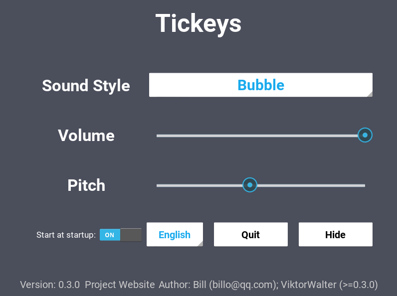

# tickeys-linux-python3

Instant audio feedback when typing. For Linux.

This fork converts the project to Python 3.
In addition, a lot of dirty stuff such as included binary blobs and static links to external sites has been cleaned.

English Readme: [English Readme](README_en_US.md)

# Screenshot

## v0.3.0

%% ## v0.2.5
%% 

%% ## v0.2.2
%% 

%% ## v0.1.9
%% 

%% ## v0.1.8
%% 

%% ## v0.1.1
%% 

%% ## v0.0.1
%% 
